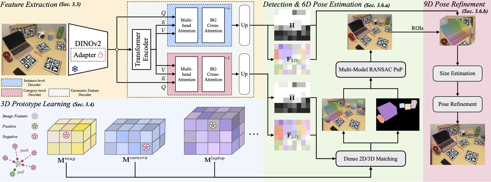

# Unified Category-Level Object Detection and Pose Estimation from RGB Images using 3D Prototypes

This is the official repository for our ICCV'25 [Paper](https://www.arxiv.org/pdf/2508.02157):

Contributors: Tom Fischer, Xiaojie Zhang, Eddy Ilg

We present a single-stage framework for RGB-only object detection and category-level 9D pose estimation. Our method aligns image features with a set of 3D object prototypes to infer object properties from 2D/3D correspondences obtained from feature matching.



## Env setup option 1: docker (recommended)

We recommend to train or evaluate our model using docker. We provide a docker image that contains all the required dependencies.

```
docker pull fischeto/upose:v1.0
```

Alternatively, you can build the docker image from the `Dockerfile` in this repository. Note that this requires to change the image name in the scripts to `upose:latest`.

```
docker build -t upose:latest .
```

## Env setup option 2: pixi (experimental)

If docker is not an option, we also provide the `pixi.toml` file to build the environment using [pixi](https://pixi.sh), so you can simply build it by running

```
pixi install
```

This will create a virtual environment with all the required dependencies. You can then activate the environment by running

```
pixi shell
```
or e.g.
```
pixi run python src/uni_dp/eval.py
```

Note that in this case you will have to take care of path mappings manually by overwriting them in the checkpoint config in the python files.

## Prepare REAL275

We follow the data preprocessing from [object-deformnet](https://github.com/mentian/object-deformnet). However, we additionally store the object sizes in the generated pickle annotation files.
In the case that regenerating the annotations is not possible, please modify the code in `src/uni_dp/dataset/real275.py`.


To regenerate the annotations, please download `deformnet_eval.zip` from [object-deformnet](https://github.com/mentian/object-deformnet).
For mug handle visibility during training, we provide `mug_handle.pkl` in [huggingface](https://huggingface.co/CassiniatSaturn/unified-detection-and-pose-estimation/tree/main), which we obtained from [HS-Pose](https://github.com/Lynne-Zheng-Linfang/HS-Pose) and simply reuploaded for ease of use.


The final folder structure should look like this:

```
REAL275
│── train
│── val
│── real_train
│── real_test
|── obj_models
|   ├── train
|   ├── val
|   ├── real_train
|   └── real_test
├── mug_handle.pkl
└── deformnet_eval
    ├── mrcnn_results
    └── nocs_results
```
Note that the `deformnet_eval` folder is not strictly required and the handle visibility annotations can be generated without it, but for full reproducibility, we recommend to use the provided annotations since they are used in our code.

Finally, run the preprocessing script to generate the annotations:

```
sh scripts/preprocess.sh
```

This script by default will assume that the data is located in `./data/`. If you want to provide a data directory, you can do so by setting the `DATA_DIR` environment variable, i.e. by running:

```
DATA_DIR=/path/to/data/REAL275 sh scripts/preprocess.sh
```

## Download Checkpoints

We provide checkpoints for the trained models on REAL275 and CAMERA. 
You can download them from [huggingface](https://huggingface.co/CassiniatSaturn/unified-detection-and-pose-estimation/tree/main) and put them into `./weights/`.

## Reproduce the results

To evaluate the model on REAL275, you can run the evaluation script. This will load the model weights from `./weights/` and evaluate the model on the validation set of REAL275.

```
sh scripts/eval.sh
```
or with a different data directory:

```
DATA_DIR=/path/to/data/REAL275 sh scripts/eval.sh
```

## Training

To train the model, you can run the training script. This will by default train on REAL275.

```
sh scripts/train.sh
DATA_DIR=/path/to/data/REAL275 sh scripts/eval.sh
```

To train on CAMERA, you can overwrite the dataset source in the config `conf/dataset/REAL275.yaml` to `source: "CAMERA"` and then run the training script again.

## Citation

If you find this repo useful in your research, please consider citing:

```
@misc{fischer2025unifiedcategorylevelobjectdetection,
      title={Unified Category-Level Object Detection and Pose Estimation from RGB Images using 3D Prototypes}, 
      author={Tom Fischer and Xiaojie Zhang and Eddy Ilg},
      year={2025},
      eprint={2508.02157},
      archivePrefix={arXiv},
      primaryClass={cs.CV},
      url={https://arxiv.org/abs/2508.02157}, 
}
```
